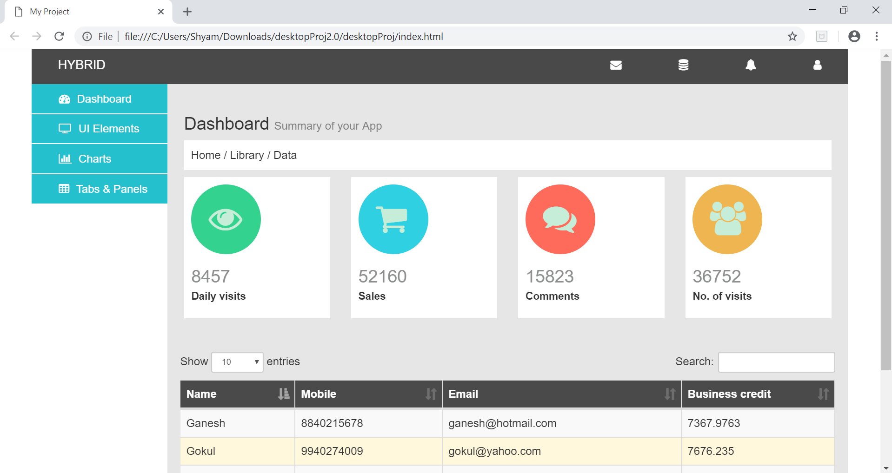
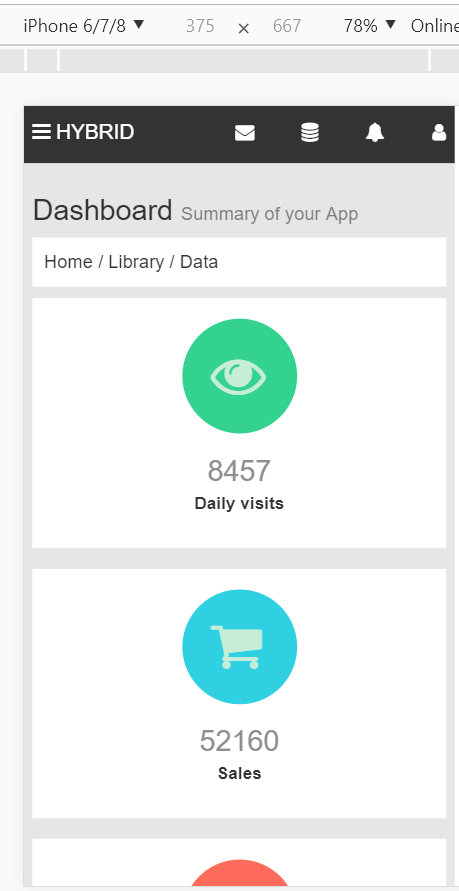

I've created a static layout with a sample dashboard design as reference. 
The sample image was imported to online site called photopea.com which is alternate to photoshop.
I used photopea to fetch the font colors and background colors.
For icons in the header, font awesome icons are used instead of images. 
Also the images inside the dashboard content are font awesome icons.

The page is made responsive with bootstrap as well as media queries. 
The left navigation menu in the desktop layout is enclosed inside the hamburger icon for mobile layout.

The mockup design has chart. Instead of charts, I've incoroprated a Table. 
The table has sorting and search features which is achieved through bootstrap datatables.

**Desktop Screenshot**

**Mobile Screenshot**
